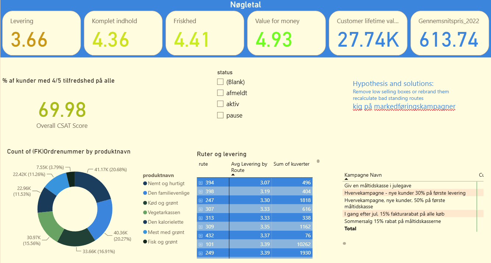
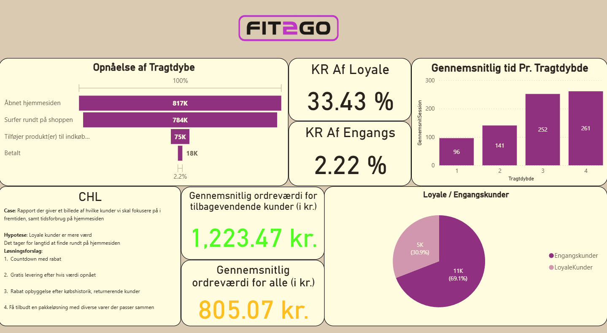
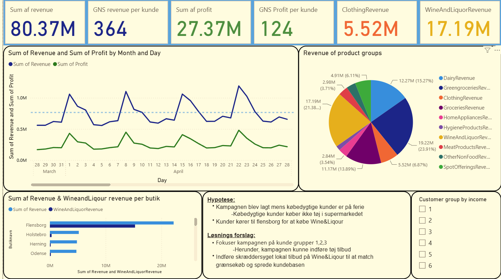

# Power BI cases

Cases fra faget Business Analytics på IT-arkitektuddannelsen, Erhvervsakademi Aarhus.
Værktøjer: Power BI, Power Query, DAX

## Måltidskasser
Dashboard der besvarer:
Hvorfor kan det være at nogle kunder stopper
deres abonnement? Er det pga. af dårlig levering,
lav kundetilfredshed, dårlige
markedsføringskampagner eller?

## Fit2Go
Dashboard der besvarer:
hvilke kunder skal der fokuseres på i fremtiden?

## Supermarked
Dashboard der besvarer:
hvorfor er markedsføringskampagnerne gået galt, og hvordan løses det?

